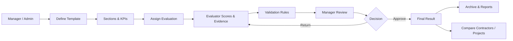
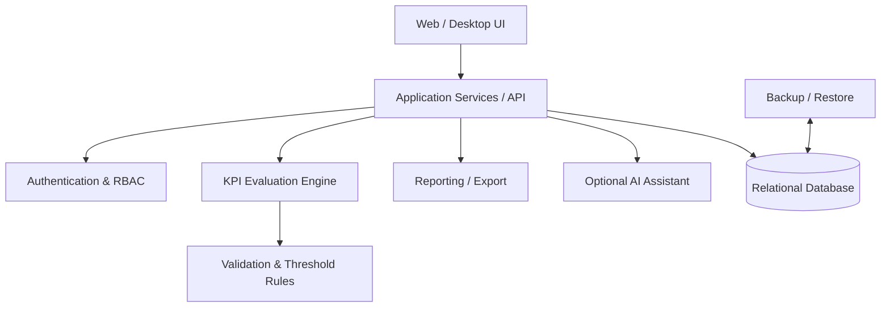

# KPI Evaluator — Public Showcase

A sanitized portfolio showcase of an organizational **KPI evaluation and performance-management platform** designed for contractor qualification, compliance checks, acceptance workflows, and structured performance assessment.

> **Portfolio boundary:** this repository intentionally excludes production source code, real organizational data, credentials, internal infrastructure details, and sensitive business rules.

## Problem

Many organizations still evaluate contractors, projects, suppliers, and operational units through spreadsheets, disconnected forms, and manual approval chains. That makes scoring inconsistent, comparison difficult, and auditability weak.

KPI Evaluator is designed to centralize that process around reusable templates, controlled workflows, configurable rules, evidence, approval, reporting, and historical traceability.

## Core workflow

## User roles

| Role | Responsibility |
|---|---|
| Manager | Governance, configuration, final review and approval |
| Evaluator | KPI scoring, evidence entry, evaluation submission |
| Viewer | Authorized read-only access to reports and results |
| Contractor | Limited access to relevant evaluation information where applicable |

## Key capabilities

- Reusable evaluation templates
- Section and KPI management
- Weighted scoring
- Mandatory requirements
- Configurable passing threshold
- Evaluator submission and manager approval
- Contractor / project comparison
- Archive instead of destructive deletion
- Role-based access control
- Organization, contractor, and project master data
- Import / export
- Backup / restore
- Email-based recovery
- Demo / seed data
- Optional AI-assisted analysis

## Example decision model

A typical policy can combine:

- an **overall passing threshold**;
- **mandatory KPIs** that must pass independently;
- **weighted criteria** with different importance levels;
- a **human approval gate** before the result becomes final.

This keeps quantitative scoring separate from organizational governance.

## Architecture overview

See [ARCHITECTURE.md](ARCHITECTURE.md) for the domain model and lifecycle.

## Design principles

### Configurable, not hard-coded
Templates, sections, KPIs, weights, thresholds, and evaluation structures should be editable without rebuilding the application.

### Human approval remains explicit
Automation and AI may assist with analysis, but they do not replace authorized organizational approval.

### Auditability
Important actions should be traceable: who evaluated, who approved, what changed, and when.

### Safe record lifecycle
Business records should be archived where possible rather than permanently deleted.

### Deployment realism
The platform is designed with real organizational constraints in mind, including on-premise and restricted-network environments.

## Technology direction

The platform has been designed around a pragmatic organizational stack, including:

- Python
- Web application architecture
- Relational database
- Docker-based deployment
- SMTP-based account recovery
- Role-based access control
- Optional offline / online AI configuration

The exact production stack may vary by deployment environment.

## AI-ready extensions

Potential assistive capabilities include:

- evaluation summary generation;
- anomaly detection across scores;
- evidence completeness checks;
- trend analysis;
- risk flagging;
- explanation of score differences;
- natural-language queries over evaluation history.

AI is treated as an **assistive layer**, not an autonomous approval authority.

## Evaluation lifecycle

1. Manager selects or creates a template.
2. Project and contractor are assigned.
3. Evaluator completes KPI scoring and evidence.
4. Validation rules check mandatory items and thresholds.
5. Evaluator submits the evaluation.
6. Manager approves or returns it.
7. Final result is archived and becomes available for reporting and comparison.

## Public demo assets

This repository includes:

- [Architecture notes](ARCHITECTURE.md)
- [Synthetic sample evaluation](SAMPLE-EVALUATION.md)
- [Example template data](examples/sample-template.json)
- [Security / disclosure boundary](SECURITY.md)

## Portfolio boundary

The showcase excludes:

- production credentials;
- real contractor names;
- confidential performance data;
- internal network details;
- proprietary documents;
- sensitive scoring rules;
- private production source code.

All examples are synthetic and intended only to demonstrate product structure and design thinking.

---

**Portfolio project by Farhad Zandi**
